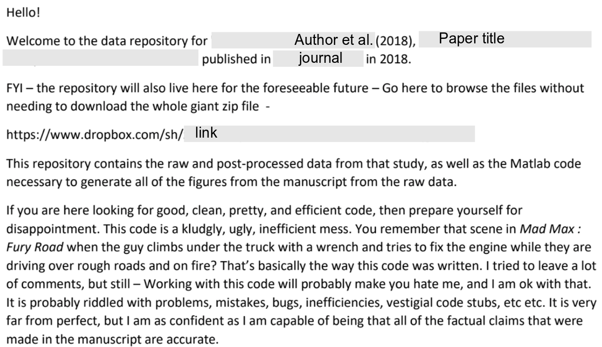

--- 
format: 
  revealjs:
    margin: 0
    theme: ../styles/uu.scss
    logo: ../images/UU_logo_2021_EN_RGB.png
    footer: "Workshop Computational Reproducibility"
---

## Welcome! Who are you? 

- What is your role/position?

- What is your faculty/background? 

- What brought you to this workshop??

## Before We Start...

::: {.theme-section}

* Ask for help when you need it! 
* Our helpers can help you with technical issues.
* Take a computer break when we take a break!

 

#### Please open the workshop site
You can find all workshop information at [tinyurl.com/repcopilot](https://utrechtuniversity.github.io/workshop-computational-reproducibility/).

:::

## Let's Git Started!

## Being Reproducible

{width=75%}

## Is this enough? {.smaller}

::: {.theme-section}

- Access to the code
- Access to the data
- (And let's assume we can replicate the enviroment)

**How confident do you feel?**

> This code is a kludgly, ugly, inefficient mess. 
(...)
>  It is probably riddled with problems, mistakes, bugs, inefficiencies, vestigial code stubs, etc etc.
(...)
> I am as confident as I am capable of being that all of the factual claims that were made in the manuscript are accurate.

 

We need to do more: we need to inspire trust.

- The code is correct (and I have made it easy for you/someone to check);
- My workflow is robust;
- My workflow *itself* is accessible, and I will be guiding you through it.

:::

## The Four Facets of Reproducibility

:::: {.columns}
::: {.column width="60%"}
::: {.theme-section}

#### Documentation
What do you need to execute this project? Where do you start?

 

#### Organization
Demonstrate a trustworthy workflow.

 

#### Dissemination
Share your data, release your code, publish your findings.

 

#### Automation

Automated analyses trace your steps, and prevent human error (or at the very least: document it).

 

:::
:::
::: {.column width="40%"}
{width=60%}
:::
:::

## What will we do in this workshop?

::: {.theme-section}

We will take you through a workflow (in a broad sense!)

- Setting up a project
- Establishing a robust backup / version control system
- Writing good code
- Writing documentation
- Making your project accessible

 

### We will end by trying to reproduce each others' projects!

:::

## What do we want to achieve?

 
We want develop **good habits** that will make our code more accessible, trustworthy, and reproducible by others. We try to focus on habits that are a **good return on investment**: meaning, they save you time in the not-so-long run.

 
 

### Enjoy the workshop!
