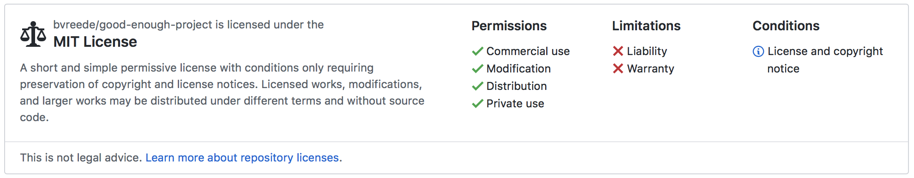

---
format:
  revealjs:
    margin: 0
    theme: ../styles/uu.scss
    logo: ../images/UU_logo_2021_EN_RGB.png
    footer: "Workshop Computational Reproducibility"
---

# Licensing {data-background-color="#FFCD00"}

## Why Licensing Matters

::: {.theme-section}

- Software is automatically protected by **copyright**: Others *cannot* reuse your code without explicit permission.
- A license grants that permission and defines **boundaries**, **conditions**, and **responsibilities**.
- Licensing is essential for:
  - Reproducibility: others must be able to run and inspect your code.
  - Collaboration: colleagues need clarity on what they may do.
  - Open Science: journals and funders increasingly require a clear license.
  - Protecting yourself: licenses limit liability and ensure attribution.

> Without a license, your code is *not legally reusable*, even if it is public on GitHub.

:::

## Choose a License Early

::: {.theme-section}

Choosing a license at the start of your project:

- Sets expectations for collaborators.
- Prevents incompatible contributions (e.g., GPL vs. MIT).
- Avoids legal or administrative issues later.
- Ensures compliance with institutional or funder requirements.
- Saves you from needing to re‑contact contributors later.

Early licensing is part of good research hygiene like documentation, folder structure, and version control.

:::

## Choosing a License

::: {.theme-section}

- There are over [80 OSI-approved licenses](https://opensource.org/licenses/alphabetical)  
  (and [many](http://dbad-license.org), [many](http://www.wtfpl.net) others).

Utrecht University recommends the **MIT License**:

{width="80%" fig-align="center"}

What is important to you?  
What does your lab use?

Try a license selector:  
<https://ufal.github.io/public-license-selector/>

:::

## Types of Software Licenses

::: {.theme-section}

- **Permissive licenses** (MIT, BSD, Apache 2.0)  
  Few restrictions; widely used in research.

- **Copyleft licenses** (GPL, AGPL, LGPL)  
  Derivative works must use the same license.

- **Restrictive / proprietary licenses**  
  Limit reuse and redistribution.

Explore options via:  
<https://choosealicense.com>

:::

## Changing a License Later

::: {.theme-section}

Changing a license is possible, but requires care:

- **Copyright ownership**  
  You must obtain permission from *all contributors* unless a CLA is in place.

- **Dependency compatibility**  
  Some licenses cannot be mixed (e.g., GPL code cannot be relicensed as MIT).

- **Downstream users**  
  Past versions remain under the old license; the new license applies only to future releases.

- **Institutional or funder requirements**  
  Some projects must use specific licenses.

If you change your license:

- Update `LICENSE.md`
- Update `README.md`
- Document the change in release notes or CHANGELOG

:::

## Data and Software

::: {.theme-section}

- There are different licenses for software and data.
- Separate code and software publications from data publications.
- Link software and data through their DOIs.
- Provide clear instructions in your README:
  - how to obtain the data  
  - how to run the software on the published dataset  

For more detail:  
<https://book.the-turing-way.org/reproducible-research/licensing/licensing-data/>

:::

## How Software and Data Licenses Differ

::: {.theme-section}

Software and data serve different purposes and therefore require **different types of licenses**:

:::: {.columns}

::: {.column width="50%"}
**Software licenses** (MIT, GPL, Apache 2.0)

- Regulate *use, modification, and redistribution* of code  
- Often include rules about derivative works and copyleft  
- May impose obligations on downstream software
:::

::: {.column width="50%"}
**Data licenses** (CC‑BY, CC0, ODbL)  

- Regulate *access, reuse, and sharing* of datasets  
- Focus on attribution, ethical reuse, and privacy  
- Do **not** impose copyleft on software that uses the data
:::
::::

**Key differences:**

- Software licenses govern **functional artifacts** (code that executes).  
- Data licenses govern **informational artifacts** (facts, measurements, text, images).  
- Software licenses may require derivative works to adopt the same license
- Data may contain sensitive or personal information, requiring additional restrictions.

:::