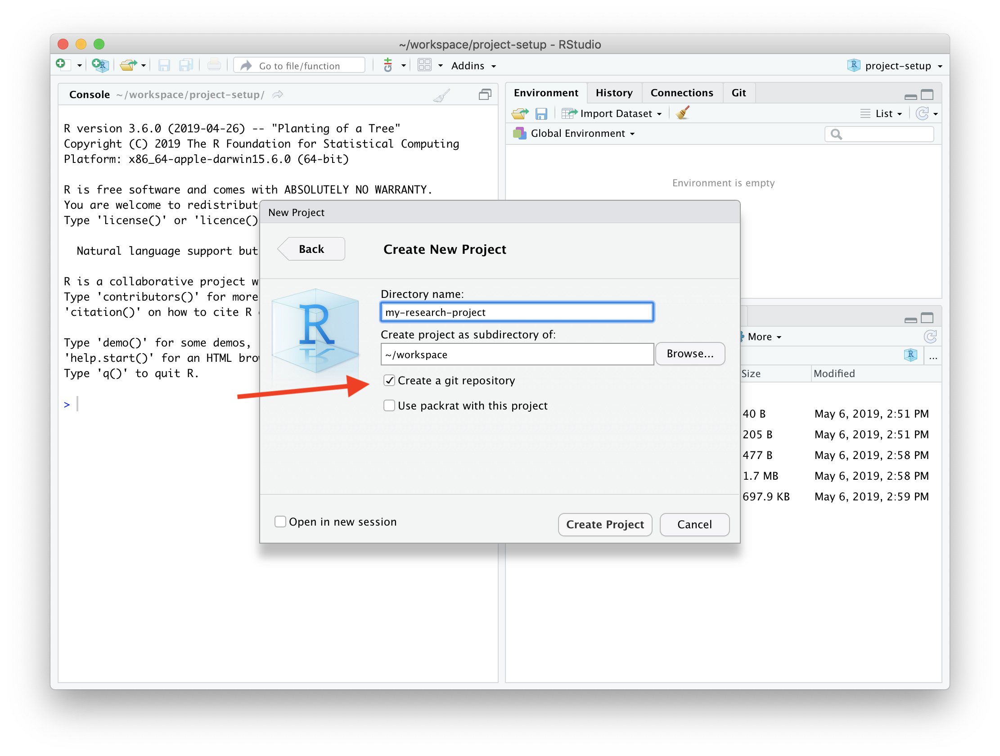

```{r setup, include=FALSE}
knitr::opts_chunk$set(echo = TRUE)
```


# Project Setup

Use an __"RStudio Project"__ + to organize files for an analysis project (scripts, data, results, documents, etc):



  
Alternatively: use an __R Package__ if your code is to be used by others outside of your own work, you should put it in a package. An R package is simply a folder with a standard layout on for R functions, documentation, data, and metadata. It makes it easy for yourself and others to install and use the code.


Regardless of working on a project or package, always use `git` to save your progress. 


  
The `usethis` R package helps you to automate package and project setup tasks. It makes everything that follows much easier. Make sure to check out the website: https://usethis.r-lib.org

# Setup a Git Repository

If not done yet in rstudio, initiate a git repository

```r
usethis::use_git()
```

Create a public project on Github:

```r
usethis::use_github()
```

# Set a license

The `License` is declared in the `DESCRIPTION` file. If you share your code on a public space, you should include a license to explain the user/reader what is allowed.

The most popular open-source licenses are MIT and GPL. The MIT license allows users to use the code for any other project (including commercial).

```r
usethis::use_gpl3_license()
```

The GPL license is more restrictive and only allows for using the code in other GPL open-source projects: 

```r
usethis::use_mit_license()
```

Both licenses require the copyright holder (you) is named in all source files.

# Unit tests (packages)

Setup unit test with the `testthat` package:

```r
usethis::use_testthat()
```

This creates a new dir `tests/testthat` in your R package. To run the tests we use:

```r
devtools::test()
```


# Roxygen (packages only)


