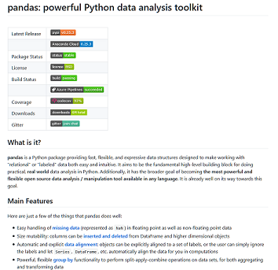
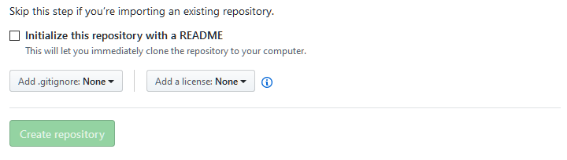

```{r setup, include=FALSE}
options(htmltools.dir.version = FALSE)
```

# Code quality defined

- Readable

- Robust

- Reusable


.footnote[
Source: [xkcd](https://xkcd.com/1513/)
]

---
# Code readability

- Code is for computer, comments are for humans.


---
# Code readability

- ~~Code is for computer, comments are for humans.~~

- Use whitespace and newlines strategically.

--

#### Compare:
```r
this <- function(arg1,arg2){res<-arg1*arg2;return(res)}
hurts <- mean(c(this(3,4),this(3,1),this(9,9))); print(hurts)
```

```r
this <- function(arg1,arg2){
  res <- arg1 * arg2
  return(res)
}

hurts <- mean(
  c(
    this(3,4),
    this(3,1),
    this(9,9)
    )
  )
print(hurts)
```


---
# Code readability

- ~~Code is for computer, comments are for humans.~~

- Use whitespace and newlines strategically.

- use descriptive names for functions and variables
  - start functions with a verb
  - make variable names _just_ long enough to be meaningful

--

#### Compare:

```python
for i in my_shopping_basket:
  if(test(i)) > 10:
    purch(i)
  else:
    disc(i)
```

```python
for item in basket:
  if(testNecessity(item)) > 10:
    purchase(item)
  else:
    discard(item)
```


---
# Code readability

- ~~Code is for computer, comments are for humans.~~

- Use whitespace and newlines strategically.

- use descriptive names for functions and variables
  - start functions with a verb
  - make variable names _just_ long enough to be meaningful

- use a consistent style
  - consistency will make your code easier to understand and maintain
  - consult a styleguide for your language (keep conventions, and don't reinvent the wheel)
  
--

#### Compare:

```r
myVar<-original_variable+MOD(new.var)
```
```r
my_var <- original_var + Modified(new_var)
```
---
# Code readability

- ~~Code is for computer, comments are for humans.~~

- Use whitespace and newlines strategically.

- use descriptive names for functions and variables
  - start functions with a verb
  - make variable names _just_ long enough to be meaningful

- use a consistent style
  - consistency will make your code easier to understand and maintain
  - consult a styleguide for your language (keep conventions, and don't reinvent the wheel)
  
### Styleguides:
  - Python style manual: [Pep-8](https://www.python.org/dev/peps/pep-0008/)
  - R style manual: [Tidyverse style guide](https://style.tidyverse.org)

---
# Code robustness, phase one

Think modular


- Functions
 - Write routines in functions, ie., code you reuse often
 - Change hard coded values by arguments in your functions
 - Identify potential functions by their action: functions perform tasks (e.g. sorting, plotting, saving a file, transform data...)


---
# Functions

Functions are smaller code units reponsible of one task.

- Functions are meant to be reused

- Functions accept arguments (values)

- What arguments a function accept is defined by its parameters

```python
def sort_data(data, how="asc", column=0):
  raise NotImplementedException("Ooops")
  
try:
  sort_data(protein_data)
except Exception as ex:
  logger.log("It went wrong")
```
---
# Your turn

Take a look at your code.
- Are you repeating yourself: do you have repeated code that could be a function?

- Is there hard coded data that you can extract (perhaps in a config file?)
  
- Finally: read your code. Ignore the comments. 
  - Is it clear what you mean? What can you rewrite?
  - Do you have difficulty interpreting variables or function names in your code? Rename them
  - Are you constructively using whitespace?
  - What does your styleguide say about CamelCase, separators_like_these or-like-these, etc..?

---
# Towards defensive programing

- Error management
 - Check values before processing them
  - Make use of try/catch mechanisms to manage exceptions
  - Make use of logging tools instead of print functions

- Do not expect users to treat your code like you expected, so expect the worst
 - use of wrong input values using your functions
 - data types
 - malformed text input

- Make use of systematic tests
 - Unit testing (event if you work alone on your code)
 - Continuous integration (if many authors work on code)

---
# Error management

- Check values with if/else

```python
if not protein_data:
  raise ValueError("Dataset cannot be empty")
```

- With try catch (called except in Python)

```python
try:
  do_something_that_might_go_wrong(protein_data)
except ItWentWrongException as ex:
  logger.log(ex)
finally:
  protein_data.to_csv("../data/processed/proteins.csv")
```
---
# Unit testing
Unit testing is a generic testing approach.

Your software is tested by focusing on smaller units, for instance a series of functions or class.

Extra packages\\imports are needed

- in R with the testthat/testthis packages
  - https://github.com/r-lib/testthat, https://github.com/r-lib/testthis
- in python with pytest, unittest
  - https://docs.python.org/3/library/unittest.html 

---
# Running unit tests
__Code editors/IDEs__ such as visual studio code, RStudio, Pycharm...

- Integrate functionalities to run and show the results of unit tests
  - E.g., RStudio in the build menu -> test package
  
1. Create a unittest file
  
  ```R
  usethis::use_test("hello")
  ```
  
2. Edit the file test-hello.R in the tests folder (created by usethis)
  
  ```R
  test_that("multiplication works", {
    expect_equal(2 * 2, 4)
  })
  ```
  
3. Run tests
  - In RStudio using the menu __or__
  ```R
    devtools::test()
  ```


---

# Project documentation

This part is about writing documentation for your project.

### Why code documentation?

- You want yourself to understand how code written some time ago works.

- You want others to understand how to re-use your code

### For this you need to 
- Explain parts of your code with __comments__
- Explain what to install in your __readme__
- Explain how to use your code in a __notebook__

---
# Comments

Comments are annotations you write directly in the code source.

- Comment lines are only for users who deal with your source code

- Explain parts that are not intuitive from the code itself

- Comments do not replace strucured code (classes, functions, ...)

- Structured comments can be used to generate documentation for users

---

# Comment lines

Comment lines are used to explain the purpose of some piece of code.


```python
# Bug fix GH 20601
# If the data frame is too big, the number of unique index combination
# will cause int32 overflow on windows environments.
# We want to check and raise an error before this happens
num_rows = np.max([index_level.size for index_level in self.new_index_levels])
num_columns = self.removed_level.
```

From https://github.com/pandas-dev/pandas/blob/master/pandas/core/reshape/reshape.py

---

# When not to use comments

- Do not repeat in natural language what is written in your code

```R
# Now we check if the age of a patient is greater than 18
if(agePatient > 18)

```

- Deactivate code

```R
# Do not run this!!
# itDoesNotWork <- optimizeMulticoreDeepLearning(myProteins)
# if(itDoesNotWork == 1444){
#    connection <- connectToHPC(currentUser, password)
#}
```

- To replace version control, like git

```R

# removed on August 5
# if() ...

#Now, it connects to the API with o-auth2, updated 05/05/2016
...

```
---
# Comments to generate documentation

- So far, we described comments use for enlightening the readers of your source code.

- Structured comments can be used to generate documentation for *users*  of your project

- Need additional tools:

  * http://www.doxygen.nl/ : c++ (and many more languages)
  * http://www.sphinx-doc.org/ : Python
  * https://roxygen2.r-lib.org/ : R

---
# A glimpse into code generation

An example with Roxygen:

```R
#' A function that says hello
#'
#' @return Nothing
#' @export
#' @examples
#' hello()

hello <- function() {
  print("Hello, world!")
}
```

Note the special symbols which differ from standard comment lines.

Namely, the #' and @ : these are special symbols that are recognized by
---
# A glimpse into code generation

In the console, in RStudio, run the following command:

```R
roxygen2::roxygenise()
```

.pull-left-larger[
The commande above will create documentation files that can be visualized by calling help(your package)
]

.pull-right-smaller[


]

.footnote[
__Remark__ This works for R packages, with the proper file structure see here : http://r-pkgs.had.co.nz/intro.html
]

---
# Readme

The contents typically include one or more of the following:

From wikipedia's [Readme]("https://en.wikipedia.org/w/index.php?title=README&oldid=923233067") page

> - __Configuration instructions__
- __Installation instructions__
- __Operating instructions__
- A file manifest (list of files included)
- Copyright and licensing information
- Contact information for the distributor or programmer
- Known bugs
- Troubleshooting
- Credits and acknowledgments


.footnote[
Templates and ideas for README
- https://gist.github.com/PurpleBooth/109311bb0361f32d87a2
- https://github.com/matiassingers/awesome-readme
]

---
# Readme examples

Examples from projects with high quality documentation

.pull-left-larger[
- Pandas: https://github.com/pandas-dev/pandas
- Scikit-learn : https://github.com/scikit-learn/scikit-learn
- Dplyr: https://github.com/tidyverse/dplyr

]

.pull-right-smaller[
__A readme files from pandas__

]

---
# Readme how?

- Readme are files that can be written as text (or markdown for formatting)

- Github will show the content of your readme file at the root of the repository

- When you create a repository on Github, there in an option to include a Readme files




---
# Notebooks

Notebooks originates from the concept of literate programming, introduced by D. Knuth in 1984.

- Idea : describe the logic of the code in natural language and include source code at the same time
- In one document from the original program can be generated
- Nowadays, literate programming evolved into Jupyter notebooks, RMarkdown documents etc.

---
# Editing notebooks

In notebooks, you have two parts:

- Text (now often in markdown, LaTex or plain text)
- Code (Python, R ...)

This means

- That there are text chuncks
- And code chunks

All chunck can be run at the same time
- Text chunks will be shown
- Code chunks will be executed and their ouput will be shown (if any)

---
# Notebook software

- RStudio with R notebooks

- Jupyter lab with jupyter notebooks

- Come code editors/integrated development environments can run notebooks
  - Pycharm, Rstudio, Visual studio ...

>This is an [R Markdown](http://rmarkdown.rstudio.com) Notebook. When you execute code within the notebook, the results appear beneath the code. 
>
>Try executing this chunk by clicking the *Run* button within the chunk or by placing your cursor inside it and pressing *Ctrl+Shift+Enter*. 
>
>```r
>plot(cars)
>```

---
# Your turn!
- Do you have any "bad" comments in your code : remove or edit them
  - Unecessary
  - Deactivated code
  - Git like comments
- Make a readme explaining What people should know to run your code again
  - Install extra tools, dependencies
  - Which environment (Python? R? and which version)
  - The main scripts that should executed
- Make a notebook
  - Describe how to use the package to analyse the data you have
  - Write in the notebook a brief introduction explaining the purpose of your script
  - Then show how to use your package and what kind of outputs it produce
  - For example, if your code has produced figures of table before (e.g., publication), show how to produce these tables again
