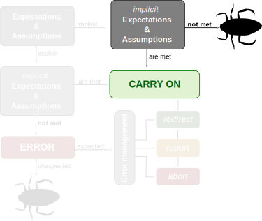
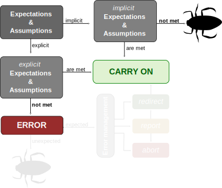
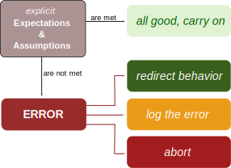

```{r setup, include=F}
options(htmltools.dir.version = FALSE)
```

# Aspects of good quality code

.pull-left[
- Readable

- Reusable

- Robust
]

.footnote[
Source: [xkcd](https://xkcd.com/1513/)
]

.pull-right[


]

---
# Code readability

- Code is for computer, comments are for humans.


---
# Code readability

- ~~Code is for computer, comments are for humans.~~

- Use whitespace and newlines strategically.

--

#### Compare:
```r
this <- function(arg1,arg2) res<-arg1*arg2;return(res)
hurts <- mean(c(this(3,4),this(3,1),this(9,9))); print(hurts)
```

```r
this <- function(arg1,arg2){
  res <- arg1 * arg2
  return(res)
}

hurts <- mean(
  c(
    this(3,4),
    this(3,1),
    this(9,9)
    )
  )
print(hurts)
```


---
# Code readability

- ~~Code is for computer, comments are for humans.~~

- Use whitespace and newlines strategically.

- use descriptive names for functions and variables
  - start functions with a verb
  - make variable names _just_ long enough to be meaningful

--

#### Compare:

```python
for i in my_shopping_basket:
  if(test(i)) > 10:
    purch(i)
  else:
    disc(i)
```

```python
for item in basket:
  if(testNecessity(item)) > 10:
    purchase(item)
  else:
    discard(item)
```


---
# Code readability

- ~~Code is for computer, comments are for humans.~~

- Use whitespace and newlines strategically.

- use descriptive names for functions and variables
  - start functions with a verb
  - make variable names _just_ long enough to be meaningful

- use a consistent style
  - consistency will make your code easier to understand and maintain
  - consult a styleguide for your language (keep conventions, and don't reinvent the wheel)
  
--

#### Compare:

```r
myVar<-original_variable+MOD(new.var)
```
```r
my_var <- original_var + Modified(new_var)
```
---
# Styleguides

  - Python style manual: [Pep-8](https://www.python.org/dev/peps/pep-0008/)
  - R style manual: [Tidyverse style guide](https://style.tidyverse.org)
  

.footnote[
Source: [xkcd](https://xkcd.com/1513/)
]
---
# Your turn

#### Where can you improve the readability of your code?

- Run a linter (e.g. `flake8` for Python or `lintr` for R) to identify conflicts with style guides.
  
- If you find code that is hard to read, make a note to work on it.
(Schedule time to refactor, but do not do this now!)

_Tip! Use_ `#TODO` _or_ `//TODO` _(depending on your comment marker) to easily find these spots later on.
Many IDEs extract these into a task list!_

---
# Code reusability

- Less code written, more work done

- Writing a tool while doing your analysis

- Stop reinventing the wheel!


---
# Code reusability: some guidelines

- Separate code and data: data is specific, code need not be

  - consider using a config file for project-specific (meta)data
  - but DO hard-code unchanging variables, e.g. `gravity = 9.80665`, **once**.
--

- Do One Thing (and do it well)

  - One function for one purpose
  - One class for one purpose
  - One script for one purpose (no copy-pasting to recycle it!)
--

- Don't Repeat Yourself: use functions

 - Write routines in functions, i.e., code you reuse often
 - Identify potential functions by action: functions perform tasks (e.g. sorting, plotting, saving a file, transform data...)
 


---
# Code reusability through functions

Functions are smaller code units reponsible of one task.

- Functions are meant to be reused

- Functions accept arguments (though they may also be empty!)

- What arguments a function accept is defined by its parameters

Functions do not necessarily make code shorter (at first)! Compare:
```r
indexATG = [n for n,i in enumerate(myList) if i == 'ATG']
indexAAG = [n for n,i in enumerate(myList) if i == 'AAG']
```

```r
def indexString(inputList,z):
	zIndex = [n for n,i in enumerate(li) if i == z]
	return zIndex
	
indexATG = indexString(myList,'ATG')
indexAAG = indexString(myList,'AAG')
```

---

# Think in building blocks!

.pull-left[
Small, cohesive units are much better than...

]
--
.pull-right[
... a customized behemoth!
]


---

# Your turn: visualize your code!

Choose:
- Make a screenshot, process it in paint, powerpoint, or your favorite editor;
- Copy paste your code to a text editor, and use markers.

The objective is for you to 'see' your code!

- Yellow denotes scripted, unstructured code _(basic, sequential lines of instructions)_
   
- Purple denotes functions or other structured code _(e.g. for-loops, conditionals, etc.)_

- Green denotes comments (or comment blocks)
   _(consider combining this with yellow for heavily commented code)_

Again, make notes in your code (`#TODO`!) if you see:
- **Scripted code**: this can be a function
- **Structured code**: this should be re-structured 

What can you learn from your colleagues today?
---
# Your turn: make a function

You have visualized your code. Use your findings to improve it!

- **Preferably**: take scripted code and turn it into a function, _or_ split an existing function into two or more functions.

- If there is no function to work on: try and address the readability of your code.

_However_: for future exercises you will need at least one function, preferably with parameters, in your code! For example:

```python
def my_function(param_a, param_b):
  if param_b == 99:
    return None
  
  if param_a == 100:
    do_something(param_a)
  else:
    do_something_else(param_a)
```
---
# Code robustness


---
# Code robustness



---
# Code robustness



---
# Error management

#### Protect the user:

- Make assumptions and expectations explicit.

  - check values before processing them
  - identify and manage exceptions
- Produce errors when expectations are not met.

- Consider error options, and perform error management:
  - redirect the program
  - log or report the error, to allow the user (or developer) to troubleshoot
  - if necessary: abort the run
  
---
# Advanced robustness: unit tests

#### Protect the developer (you!)

- Test the expected behavior of your functions:
  - Confirm a known output given a known input
  - Do errors get produced as expected when the input calls for it?
  
- Capture unexpected errors to identify further options for error management

- You can automate running tests when pushing to Github using Continuous Integration

- Tests are **definitely** worth learning when your project increases in size!

_More on tests later..._

---
# Throwing an error
```{python, error=TRUE}
def read_vector_value(index=0, my_vector=[10,5,4,12,25]):
    if index > len(my_vector) - 1:
        raise IndexError('Index higher than vector length.')
    return my_vector[index]

read_vector_value(index=6)
```
--
#### Why not simply adjust the function output?
```{python, error=TRUE}
def read_vector_value(index=0, my_vector=[10,5,4,12,25]):
    if index > len(my_vector) - 1:
        return None
    return my_vector[index]

print(read_vector_value(index=6))
```
--
_Because it is unclear if `None` is expected behavior or indicative of a problem._
---
# Warning message without breaking
#### An error breaks code execution
```{R, error=TRUE}
read_vector_value <- function(index=1,my_vector=c(10,5,4,12,25)){
  if(index>length(my_vector)){
    stop("Index higher than vector length.")}
return(my_vector[index])
}

print(read_vector_value(index=6))
```
--
#### Capture the error but release a warning
```{R, error=TRUE}
read_vector_value <- function(index=1,my_vector=c(10,5,4,12,25)){
  if(index>length(my_vector)){
    warning("Index higher than vector length.")
    return(NA)}
return(my_vector[index])
}

print(read_vector_value(index=6))
```
---
# Redirecting with exceptions

If you do not want to interrupt your script when an error is raised: use try/catch ('except' in Python). NB: Note that Python allows you to distinguish by error type!
```{python, include=F}
# ensure that the function is correctly in memory
def read_vector_value(index=0, my_vector=[10,5,4,12,25]):
    if index > len(my_vector) - 1:
        raise IndexError('Index higher than vector length.')
    return my_vector[index]
```
.pull-left[
```{python, error=TRUE}
try:
  read_vector_value(6)
except IndexError:
  print("This is an exception")
```
]
.pull-right[
```{python, error=TRUE}
try:
  read_vector_value(6)
except ArithmeticError:
  print("This is an exception")
```
]

--

#### In R you can use [tryCatch()](http://www.mazamascience.com/WorkingWithData/?p=912):
```{R, include=FALSE}
read_vector_value <- function(index=1,my_vector=c(10,5,4,12,25)){
  if(index>length(my_vector)){
    stop("Index higher than vector length.")}
return(my_vector[index])
}
```
```{r}
tryCatch({
    read_vector_value(6)
}, error = function(e) {
    print("This is an exception.")
})
```

---
# Validating input

Consider early statements in the script to validate (data) input.

With if/else:
```python
if not protein_data:
  raise ValueError("Dataset cannot be empty")
```

With try/catch:
```r
tryCatch({
  do_something_that_might_go_wrong(protein_data)
}, error = function(e){
  log(e)
}, finally = {
  cleanup(protein_data)
})
```
---
# Expectations and assumptions

#### Expect the worst
- use of wrong input values for functions
- malformed text input
- wrong data types


.footnote[
Source: [cartoontester](https://cartoontester.blogspot.com/2010/02/thats-not-bug.html)
]
---

# Your turn: explicit expectations

#### Identify assumptions in your code
- What assumptions/expectations exist on your data or (user) input?
- What assumptions/expectations exist on the input of (a) function(s)?
  
#### Make the input/data assumptions explicit
- **Option 1**: Explicitly state assumptions on data or input in your README.md.
- **Option 2**: Write a piece of code that tests the validity of data/input, and reports an error if the expectations are not met.

#### Test the input for a function
- Modify the code inside your function to
  - check the value of the arguments passed to your function using if/else statements;
  - raise an error in case an argument is out of the range of acceptable values.

---

# Unit testing
Unit testing is a generic testing approach.

Your software is tested by focusing on smaller units, for instance a series of functions or class.

Extra packages\\imports are needed

- in R with the testthat/testthis packages
  - https://github.com/r-lib/testthat, https://github.com/r-lib/testthis
- in python with pytest, unittest
  - https://docs.python.org/3/library/unittest.html 

---
# Running unit tests
__Code editors/IDEs__ such as visual studio code, RStudio, Pycharm...

- Integrate functionalities to run and show the results of unit tests
  - E.g., RStudio in the build menu -> test package
  
1. Create a unittest file
  
  ```R
  usethis::use_test("hello")
  ```
  
2. Edit the file test-hello.R in the tests folder (created by usethis)
  
  ```R
  test_that("multiplication works", {
    expect_equal(2 * 2, 4)
  })
  ```
  
3. Run tests
  - In RStudio using the menu __or__
  ```R
    devtools::test()
  ```
---
# Example

#### Testing our read_vector function

```{python}
import unittest
class TestStringMethods(unittest.TestCase):
    def test_retrieval(self):
        self.assertEqual(read_vector_value(0), 10)
    
    def test_error(self):
        with self.assertRaises(IndexError):
            read_vector_value(5)

```

Run the tests by calling `unittest.main()`

Or, when working in a notebook:
```{python}
unittest.main(argv=['trick to make it work in a notebook'], exit=False)
```
---
# Making a test fail

```{python}
import unittest
class TestStringMethods(unittest.TestCase):
    def test_retrieval(self):
        self.assertEqual(read_vector_value(0), 10)
    
    def test_error(self):
        with self.assertRaises(IndexError):
            read_vector_value(5)
            
    def test_retrieval_wrong(self):
        self.assertEqual(read_vector_value(0), 11)

```
---
# Result of faulty test

```{python, echo=FALSE}
unittest.main(argv=['trick to make it work'], exit=False)
```
