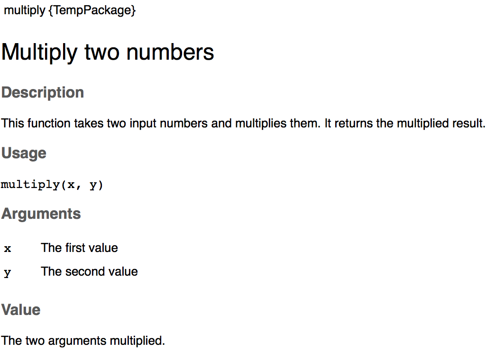
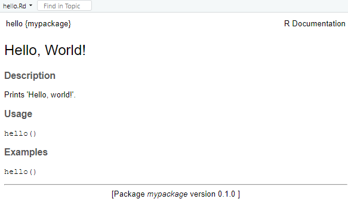
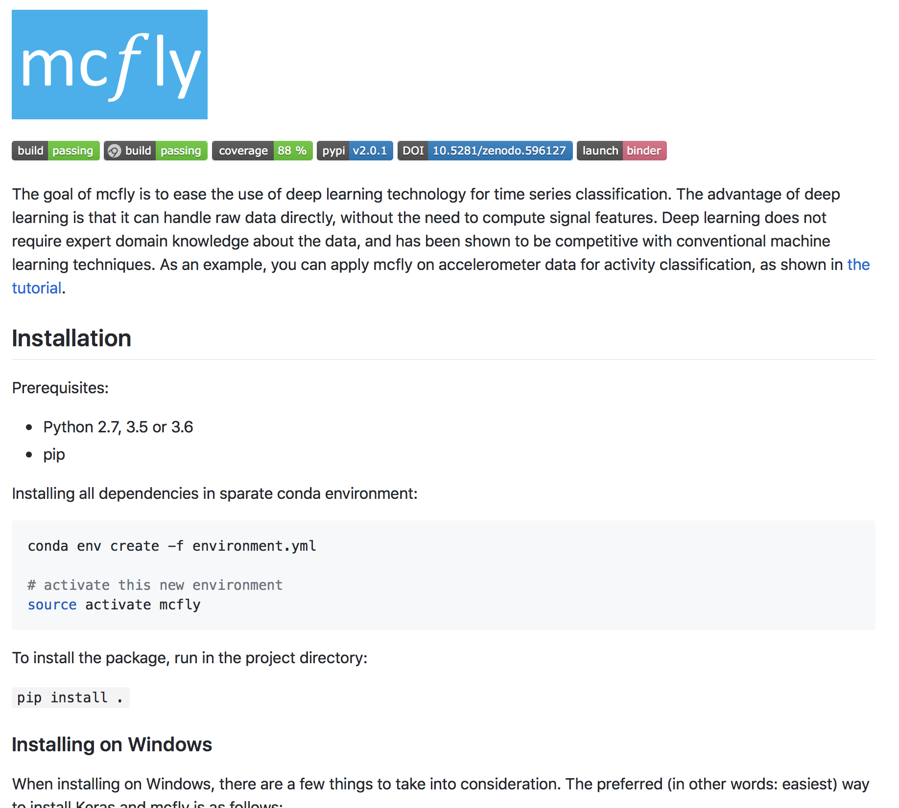
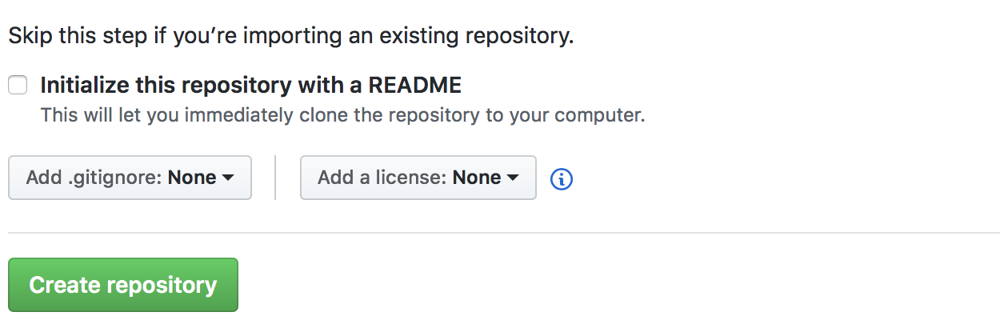

```{r setup, include=FALSE}
options(htmltools.dir.version = FALSE)
```

# Project documentation

#### Why do you need documentation?

- You want yourself to understand how code written some time ago works

- You want others to understand how to (re-)use your code

--

#### For this you need to 
- Explain parts of your code with __comments__

- Explain what to install and how to get started in your __readme__

- Explain in-depth use of your code in a __notebook__


---
# Comments
#### Comments are annotations you write directly in the code source.
.pull-left[
They:

- are written for users who deal with your source code

- explain parts that are not intuitive from the code itself

- **do not** replace readable or structured code

- (in a specific structure) can be used to directly generate documentation for users.

.footnote[Comic source: [Geek & Poke](https://geekandpoke.typepad.com/geekandpoke/2011/06/code-commenting-made-easy.html)]
]

.pull-right[


]
---

# When *not* to use comments

- ...to repeat in natural language what is written in your code

```r
# Now we check if the age of a patient is greater than 18
if(agePatient > 18)

```
--
- ...to turn old code into zombie code (fine for troubleshooting, but do not leave it in!)

```r
# Do not run this!!
# itDoesNotWork <- optimizeMulticoreDeepLearning(myProteins)
# if(itDoesNotWork == 1444){
#    connection <- connectToHPC(currentUser, password)
#}
```
--
- ...to replace version control, like git

```r

# removed on August 5
# if() ...

#Now, it connects to the API with o-auth2, updated 05/05/2016
...
```
---

# Comment lines: WHY over HOW

Comment lines are used to explain the **purpose** of some piece of code.
```python
# Bug fix GH 20601
# If the data frame is too big, the number of unique index combination
# will cause int32 overflow on windows environments.
# We want to check and raise an error before this happens
num_rows = np.max([index_level.size for index_level in self.new_index_levels])
num_columns = self.removed_level.
```
*From [Pandas reshape.py documentation](https://github.com/pandas-dev/pandas/blob/master/pandas/core/reshape/reshape.py)*
---
# Docstrings

- Structured comments, associated to *segments* (rather than lines) of code, can be used to generate documentation for users*  of your project.

- These comments are called *docstrings*.

- Docstrings are parsed as the first statement of a module (e.g. a function or class).

- Docstrings allow you to provide documentation to a function, that is relevant to the user of that function.

- Writing docstrings makes you generate your documentation as you are generating the code: efficiently, comprehensively!


.footnote[*) Remember? That's probably you!]
---
# Generating docstrings
In R you will need a separate package to deal with docstrings:

.pull-left[
```r
library(docstring)

#' @title Multiply two numbers
#' @description This function takes two 
#' input numbers and multiplies
#' them. It returns the multiplied result.
#' @param x The first value
#' @param y The second value
#' @return The two arguments multiplied.
multiply <- function(x,y){
  return(x*y)
}

?multiply
```
]
--
.pull-right[

]

*Much more information in the [vignette for docstring.](https://cran.r-project.org/web/packages/docstring/vignettes/docstring_intro.html)*

---
# Generating docstrings
In Python, docstrings are string literal comments following a function declaration:

```python
def multiply(x,y):
  """
  Multiply two numbers
  
  This function takes two input numbers and multiplies them.
  It returns the multiplied result.
  Keyword arguments:
  x -- the first value
  y -- the second value
  """
  return x*y
```
NB: a triple single quote (`'''`) works, but PEP style prefers double quotes for docstrings.
---

# A glimpse into code generation

Docstrings are formatted so that they can easily be turned into documentation of your package.

You will need additional tools:

  * http://www.doxygen.nl/ : C++ (and many more languages)
  * http://www.sphinx-doc.org/ : Python
  * https://roxygen2.r-lib.org/ : R

We will not do this today, but it is worth checking out if you want to release your code!
---
# A glimpse into code generation

In the console, in RStudio, run the following command:

```R
roxygen2::roxygenise()
```

.pull-left-larger[
The command above will create documentation files that can be visualized by calling help(your package)
]

.pull-right-smaller[



]

.footnote[
__NB__ This works for R packages, with the proper file structure. See here: http://r-pkgs.had.co.nz/intro.html
]

---
# Your turn (choose one!)

#### 1. Comment lines
  
a. Do you have superfluous comments? **Remove them!**
   - Remove your zombie code and version control-like comments
   - See if you can replace a 'how' comment for a 'why' comment (_what is the purpose of this code?_ rather than _this is how this code works_)

b. Are there elements without comments that need them? **Add them!**
  - Have you found yourself staring at a piece of code for too long without understanding it? Perhaps it needs more information!
  - Try to comment on the thought behind the code rather than phrasing it in English. 
  
  
#### 2. Docstrings
- Add a docstring to a function, preferably the last function you worked on (so it's fresh in your memory).
- Keep in mind: what does my user need to know when they are working with this function?

---
# README

The README page is the first thing your user will see!

The contents typically include one or more of the following:

> - __Configuration instructions__
- __Installation instructions__
- __Operating instructions__
- A file manifest (list of files included)
- Copyright and licensing information
- Contact information for the distributor or programmer
- Known bugs
- Troubleshooting
- Credits and acknowledgments

*From wikipedia's [Readme]("https://en.wikipedia.org/w/index.php?title=README&oldid=923233067") page*
---
# An example


---
# README examples and templates

Some examples from projects with high quality documentation:

Bigger community software projects:
- Python's [Pandas](https://github.com/pandas-dev/pandas)
- [Scikit-learn](https://github.com/scikit-learn/scikit-learn)
- Tidyverse's [Dplyr](https://github.com/tidyverse/dplyr)

Research software:
- e-science center's ['McFly' tool](https://github.com/NLeSC/mcfly)
- Utrecht University's: [Automatic Systematic Review](https://github.com/msdslab/automated-systematic-review)
- Utrecht University's [MICE](https://github.com/stefvanbuuren/mice)


Templates and ideas:

- https://gist.github.com/PurpleBooth/109311bb0361f32d87a2
- https://github.com/matiassingers/awesome-readme


---
# README how?

- When you create a repository on Github, there is an option to include a README file

- READMEs are files that can be written as text, and commonly use Markdown for formatting.

- Github will show the content of your README file at the root of the repository.

- Your cookiecutter template included a README, so you are all set!

---
# Your turn!

Edit your README file.

Make sure to include the following information:
- What does your project do?
- How do you start running your project?
  - How does the user download your project? (consider `git clone`!)
  - How does the user call the main script(s) that should be executed?
  
And perhaps any other elements you are inspired to add (check out the examples!)