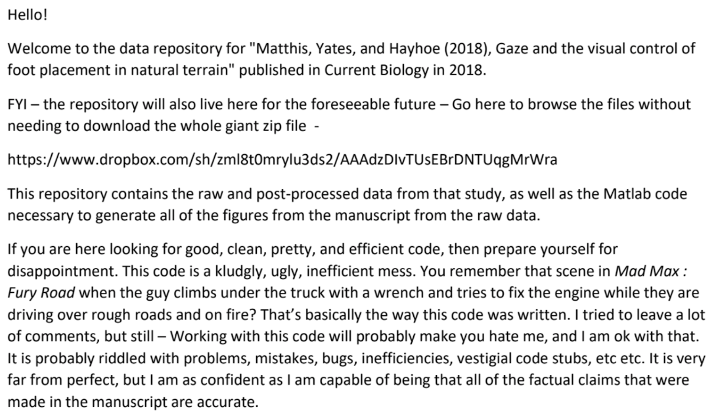

```{r setup, include=FALSE}
options(htmltools.dir.version = FALSE)
```

# Thanks!

- To you for being here!

- To the [Open Science Community Utrecht (OSCU)](https://openscience-utrecht.com) and [Research Data Management Support (RDM Support)](https://www.uu.nl/en/research/research-data-management) for supporting the development of this workshop

- To Armel Lefebvre, Bianca Kramer, Cedric Thieulot, Erik van Sebille, Jeroen Bosman, Jeroen Ooms, Jonathan de Bruin, Lukas van de Wiel, Mateusz Kuzak, Menno Fraters, Neha Moopen, Philippe Delandmeter, and Renato Alves, for helping develop this workshop

- To your teachers and helpers today!

#### Who are you? What brings you here?

- E.g. your name, pronouns, background, and motivation for this workshop.


---

# General guidelines (and advice!)
- Ask for help when you need it! 
  - You can ask a question in the Teams chat.
     - We will try to answer it directly.
  - Indicate you are stuck in the Status Chart ([tinyurl.com/repcochart](https://tinyurl.com/repcochart))
     - We will invite you to a 1:1 call in a Helper channel.

--

- Please mute yourself when you are not speaking (we are strict and will mute you without warning)

--

- We appreciate your video, but only share if you are comfortable.

--

- Close as many unnecessary windows and programs as possible.

--

- Take a computer break when we take a break: a timer will show when we return!

--

### Please open the workshop site
You can find all workshop information at [tinyurl.com/repcopilot](https://utrechtuniversity.github.io/workshop-computational-reproducibility/).


---
# Being reproducible


---
# Is this enough?

- Access to the code
- Access to the data
- (And let's assume we can replicate the enviroment)

How confident do you feel?
--

> This code is a kludgly, ugly, inefficient mess. 
(...)
>  It is probably riddled with problems, mistakes, bugs, inefficiencies, vestigial code stubs, etc etc.
(...)
> I am as confident as I am capable of being that all of the factual claims that were made in the manuscript are accurate.

--

We need to do more: we need to inspire trust.
- The code is correct (and I have made it easy for you/someone to check);
- My workflow is robust;
- My workflow *itself* is accessible, and I will be guiding you through it.


---
# The Four Facets of Reproducibility

.pull-left-medium[
#### Documentation
What do you need to execute this project? Where do you start?

#### Organization
Demonstrate a trustworthy workflow.

#### Automation
Automated analyses trace your steps, and prevent human error (or at the very least: document it).

#### Dissemination
Share your data, release your code, publish your findings.]

--
.pull-right-medium[

]
---
# What will we do in this workshop?

We will take you through a workflow (in a broad sense!)

--

- Setting up a project

- Establishing a robust backup / version control system

- Writing good code

- Writing documentation

- Making your project accessible

--

We will end by trying to reproduce each others' projects!


---
# What do we expect from you?

- Our group has many different abilities and experiences. We hope you will value this as much as we do!

- We have done our best to make the workshop asynchronous so you can work at your own pace.

- However, we have incorporated several moments for shared discussion and questions. Use them!

- Feel free and safe to share your expertise and experiences.

--

#### Our objectives for you
We want to teach you **good habits** that will make your work more accessible, trustworthy, and reproducible by others. In doing so, we have tried to identify those habits that are a **good return on investment**: meaning, they save you time in the not-so-long run.

--

### And finally: we hope you enjoy the workshop