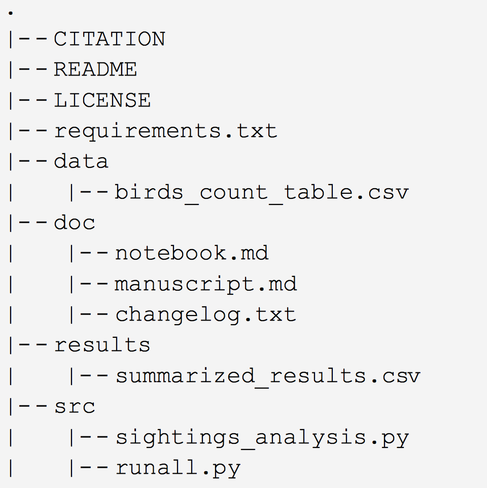
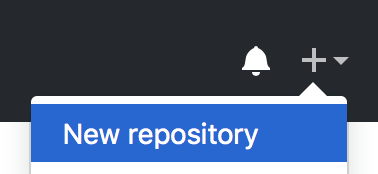

```{r setup, include=FALSE}
options(htmltools.dir.version = FALSE)
```

# Research compendium

> A research compendium is a collection of *all digital parts of a research project* including data, code, texts (...). The collection is created in such a way that reproducing all results is straightforward.

*Source: [The Turing Way](https://the-turing-way.netlify.app/reproducible-research/compendia.html)*


.footnote[(Artwork by Scriberia for [The Turing Way](https://the-turing-way.netlify.app/welcome.html), CC-BY)]
---
# Getting started

.pull-left[
- Contain your project in a single recognizable folder

- Distinguish folder _types_, name them accordingly:
  - **Read-only**: data, metadata
  - **Human-generated**: code, paper, documentation
  - **Project-generated**: clean data, figures, models...

- Initialize a **README** file, document your project

- Choose a **license**

- Publish your project.]

.pull-right[
-
[Wilson _et al._ (2017)](https://doi.org/10.1371/journal.pcbi.1005510)
]

---

# Cookiecutter

You can set up a project template using a nifty tool called cookiecutter.

First, ensure you have cookiecutter installed:
```bash
pip install cookiecutter
```
or with conda:
```bash
conda install cookiecutter
```

Trouble with conda or pip? Check the instructions [here](../preparations), or try the following alternatives:

- MacOS X with Homebrew:
```bash
brew install cookiecutter
```
- Debian/Ubuntu:
```bash
sudo apt-get install cookiecutter
```
---
# Cookiecutter


> A command-line utility that creates projects from cookiecutters (project templates). e.g. creating a Python package project from a Python package project template.
>
> _[cookiecutter.readthedocs.io](https://cookiecutter.readthedocs.io/en/latest/)_

There are MANY templates available for your purposes. [Take a look!](https://github.com/cookiecutter/cookiecutter)

We have designed a template based on [this paper by Wilson _et al._](https://doi.org/10.1371/journal.pcbi.1005510) (2017). Go ahead and install it!

```bash
cookiecutter gh:bvreede/good-enough-project
```

Answer the questions cookiecutter asks you, and browse the resulting project to see where your answers ended up.

---
# Backup option

Did cookiecutter not work for you? We have a backup option:

- Navigate to the location where you want to create your project.

- Then clone this template repository:
```bash
git clone https://github.com/bvreede/good-enough-project-template.git
```

- We will initialize a git repository here. But for now: please remove the `.git` folder.
  - Use your GUI explorer, not your terminal for this step!
  - Ensure hidden files/folders are shown (on mac: press `cmd` + `shift` + `.` (dot)).
  - Delete the entire `.git` folder in your project folder.


---
# Your turn

- Place your project files in the right folder.
- Adjust paths in your code, and be sure to use relative (see next slide) paths! 
- It is fine to have the main script (e.g. `main.py`) in the home folder!

```
.
├── .gitignore
├── CITATION.md
├── LICENSE.md
├── README.md
├── requirements.txt
├── bin                <- Compiled and external code, ignored by git (PG)
│   └── external       <- Any external source code, ignored by git (RO)
├── config             <- Configuration files (HW)
├── data               <- All project data, ignored by git
│   ├── processed      <- The final, canonical data sets for modeling. (PG)
│   ├── raw            <- The original, immutable data dump. (RO)
│   └── temp           <- Intermediate data that has been transformed. (PG)
├── docs               <- Documentation notebook for users (HW)
│   ├── manuscript     <- Manuscript source, e.g., LaTeX, Markdown, etc. (HW)
│   └── reports        <- Other project reports and notebooks (e.g. Jupyter, .Rmd) (HW)
├── results
│   ├── figures        <- Figures for the manuscript or reports (PG)
│   └── output         <- Other output for the manuscript or reports (PG)
└── src                <- Source code for this project (HW)
```
---
# A note on paths

- Your project should be transportable between computers.

- For this reason, you should use **relative paths** only: compare
  - `/Users/barbara/Dropbox/proteindomains/data/zincfinger.json`
  - `./data/zincfinger.json`

- `./` means: in this folder

- `../` means: one folder up
---

# Choosing a license

- Copyright is implicit; others cannot use your code without your permission.

- Licensing gives that permission, and its boundaries and conditions.

- Choosing a license early on means being aware of your license as the project proceeds (and not creating conflicts).

- There are over [80 OSI-approved licenses](https://opensource.org/licenses/alphabetical) (and [many](http://dbad-license.org), [many](http://www.wtfpl.net) others) to choose from.

This is one I like to use:


What is important to you? What does your lab use? [Choose your own license!](http://choosealicense.com)

---
# Publishing your project

Uh... Isn't 'publication' the thing you do... _at the end?_ 

--

No! Publishing your project at an early stage
- forces you to consider readability throughout
- minimizes the mess you have to deal with when you (finally) decide to publish
- allows collaboration and support
- facilitates sharing and re-use.

--

_But what if someone scoops my code! I'm a revolutionary, they will steal my ideas!_

If you are super paranoid, you can always opt for a private repository. It is your work & up to you. But consider the advantages!

---
# Publishing unpublished data

- If you have sensitive data...

 - Don't include your data in your software repository (that's not what they are for anyway).
 - Consider generating simulated data so your code can run regardless.

- And for all data:

  - Your data should be separate from your code!
  - If your code references your data, consider a config or metadata file for these references.


---
# Where do I publish?
.pull-left-larger[
### Living project: github
(or other social coding platform):

- synergistic with version control software git

- makes history public and accessible _(eek!)_

- allows publication of different releases

- provides a platform for interaction and collaboration

### Archiving a release: zenodo
(or other stable repository, like the [OSF](https://vickysteeves.gitlab.io/2018-uutah-repro/the-open-science-framework.html))
- [direct archiving supported](https://guides.github.com/activities/citable-code/) from github to zenodo

- this gives you a **doi** (digital object identifier): your code is citeable!
]
.pull-right-smaller[


]

---

# Why do you need version control?

.pull-left[

- It will help you manage ~~your code~~ most of your files (it is like track changes on steroids: it applies to all files in a folder).

- It allows you to trace back your steps: if something breaks, you can figure out what happened.

- NO MORE thesis_final_final_SERIOUSLYFINAL.Rmd

#### even better:
- a good version control system allows you to collaborate and share!

- a good version control system facilitates experimentation!

]

.pull-right[

]
---
.pull-left-larger[
# What is git?
- Distributed Version Control system written by Linus Torvalds (of Linux fame)

- Allows you to log updates, branch your work (so you can experiment without losing the original!), and keep all backups, while efficiently using your storage

- Gives user a lot of control on what to track, and adds a narrative to changes ('commit comments')

- Current standard for code

- Open Source software written for the command line...

- ... but many GUI-clients exist nowadays, and most coding IDEs have built-in git.]
.pull-right-smaller[


]

---
# Your turn: starting with git

1. (You should have installed git by now! If you have not: [git-scm.com](https://git-scm.com).)

1. Navigate to your project folder in a terminal.
```bash
cd [path/to/project_folder]
```
1. Initiate a git repository in this location:
```bash
git init
```
1. Add all your files to the staging area:
```bash
git add *
```
1. Commit all the files in the staging area to your repository:
```bash
git commit -m "First commit"
```

---
# Your turn: connecting to github

1. Go to your github account and add a new repository (click '+', then 'New repository'):

   

1. Fill out the information for your new repository. DO NOT initialize the repository yet!

  
  
1. Set the origin of your local repository to the URL of your repo on github:
```bash
git remote add origin git@github.com:[youraccount]/[yourrepo].git
```


---
# Your turn: pushing to github

You can now push the content of your local repository to the one on github:

```bash
git push -u origin master
```

Congrats, your local repository now has an online representation!

 \\\_\_\_ _THANK YOU!_

Take a look at your online repository. Who is the author of your commits? If it is not you, you can configure git to use your identity (make sure github knows this email address):
```bash
git config --global user.name "Your Name"
git config --global user.email "your@email.com"
```

---
# Your workflow

1. Add the changed file(s) to the staging area, and commit the changes:
```bash
git add src/filename.py anotherfile.txt
git add config/configfile.json
git commit -m "My commit message"
```
OR

2. commit files directly, without staging:
```bash
git commit src/filename.py anotherfile.txt -m "My commit message"
```

NB: don't forget your commit message (try what happens if you do!).

.footnote[
Image credit:<br />
Software Carpentries
]
---
# What else can I do with git?

Check the status of your repository:
```bash
git status
```
Check the log of your previous commits:
```bash
git log
git log --oneline
```
What differences are there between your last commit and your workspace? (Or between two previous commits...)
```bash
git diff
git diff HEAD~3
```
SO much more!
```bash
git --help
```

---
# .gitignore

The .gitignore file in your template contains files that **by definition** will not be tracked by git.

For example, if you do not want to track a file .DS_Store (always present on my mac), you enter a line like this in your .gitignore file:
```bash
.DS_Store
```
Similarly, you can ensure all output in a folder will not be tracked:
```bash
results/
```

Or all files with a certain extension:
```bash
 *.dat 
```

_NB: There is a .gitkeep file in your template -- this does not do the opposite to .gitignore, but is instead used as a placeholder for folders: git does not track empty folders..._

---
# Your turn!

1. Continue moving your files into the file template.

1. Add, commit, and push all files you want to track! (Do you want to move a tracked file within a git repository?
`git mv path/to/file.svg newpath/file.svg`
and don't forget to commit!)

1. Are there (temporary) files you do not wish to track? Add them to the .gitignore file. Consider a .gitignore template for your language: [examples on this github repo](https://github.com/github/gitignore).

1. Continue editing your code, and add/commit/push your changes. Can you do it from your IDE?

1. Experiment with editing and committing on github itself. You can then 'download' your code to your local repository using `git pull`.

1. What happens if you edit the same file online and locally, and try to push/pull?

---
# Enjoy, and git responsibly!

- Commits should be atomic: comprehensive 'units' of changes.
  - **DO**: edit/add an .svg and add it to your .Rmd presentation in the same commit
  - **DON'T**: edit for a full day and put this in a single commit (or worse: forget to...)

- Commits should have informative messages so you (and others) can trace your steps

  

- Track most files; .gitignore those files you don't.

- Explore new ideas with branches, keep a stable version on `master`


---
# Do you want to learn more?

- A [Software Carpentry course on git](https://swcarpentry.github.io/git-novice/)

- A [version control + git tutorial](https://www.atlassian.com/git/tutorials/what-is-version-control) on Atlassian

- A [git cheatsheet](https://www.atlassian.com/git/tutorials/atlassian-git-cheatsheet) from Atlassian

- A book with [all the ins and outs of git](https://www.git-scm.com/book/en/v2) from the git website


