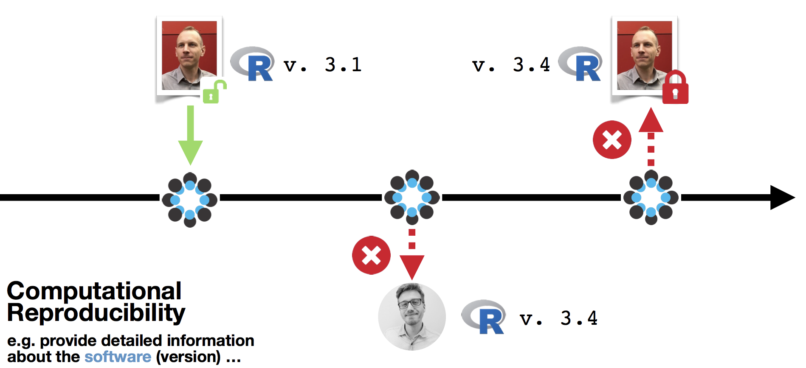

```{r setup, include=FALSE}
options(htmltools.dir.version = FALSE)
```

# Congratulations!

You now have a project!
- Your project structure is accessible
- Your code is readable and invites re-use
- The project is under version control
- It has a landing page on Github, with user information

Are you done?

--

_Not quite yet!_
It's time to think about the future...

--

#### Will GitHub still be here in five years? Will my account? Will this repository?

---
# Archiving the project

- Create a project release to get a feel for it:


- Fill out the form but tick the 'this is a pre-release' box.

- If you do this after connecting the repository to Zenodo, the release will trigger Zenodo to archive the project.

- After completing the workflow, your project will have a permanent home on Zenodo, including a **Digital Object Identifier** (DOI)!

- _Check the full how-to [on GitHub](https://guides.github.com/activities/citable-code/)._

---
# All done?


#### It depends...


---
# Dependencies

Dependencies and versions can stop your users/readers from being able to run your code.


.footnote[Source: [Timo B. Roettger on OSF](https://osf.io/e9bu7/).]

---
# The reproducibility trade-off

- Making your project 100% reproducible can be tricky.


- That said, tools like Docker and Singularity probably sound more daunting than they actually are.

- Even more user-friendly (though possibly expensive...) options exist: like [CodeOcean](https://codeocean.com).

- **But**: due diligence starts at simply declaring dependencies.

.footnote[Image source: [Cole Arendt at Rstudio.com](https://rviews.rstudio.com/2018/01/18/package-management-for-reproducible-r-code/)]
---
# R: session_info

```{r}
sessionInfo()
```

---
# What works for you?

- Declare how your project works **for you**.
  - What language, what version?
  - What packages/libraries do you load
  - What OS do you use? (Does it work on your collaborator's system?)

- This information should be in the requirements file of your project.


---
# R: Packrat

Install the package from CRAN
```r
install.packages("packrat")
```

Initialize packrat
```r
packrat::init("~/path/to/your/project")
```

Your packages are now stored in `~/path/to/your/project/packrat/lib`

If you need to re-save dependencies (for example, if you have added another package), you can use packrat:

```r
packrat::snapshot()
```

---
# Your turn!

Add detailed requirement information to your requirements file.

Add basic dependency information to your readme file: what version of your language is required, and which packages does a user need to load before running your project?