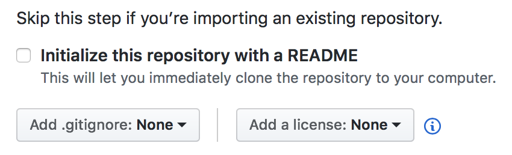

# Version control

When you are working on a project -- any project! -- you want to keep track of your files. You are probably familiar with systems like track changes in word, or with broader backup systems that are in use on e.g. Dropbox, Apple TimeMachine, Google Docs, etc. These are version control systems, and they make sure histories are saved while efficiently using storage. However, these systems do not allow a lot of control for the user, and their features are limited to keeping an image of arbitrary historical versions. You need more!

Managing your files with a designated version control system means you can, among other things
1. manage different versions of one code (switch/merge)
2. write new features while using the main code
3. collaborate on one code between many authors (scales well)
4. have easy and efficient backup of different versions of one code

There are various version control systems available, but one is particularly popular: git, which was developed by Linus Torvalds himself.

## Version control with git

### How do you install git

You can install git from [git-scm.com](http://git-scm.com).

### How does git work?

1. starts with an empty directory using *git init*
2. every change is tracked; this is called a *diff*
3. sets of changes can be saved; this is called a *commit*
4. sets of one to many commits form a *branch*
5. you can change between different branches using *git checkout*

### How does this help?

Using git means you will efficiently manage your code: different version are just different sets of commits. It becomes easy to develop and try out new features: start with a branch and add new commits. You can add those commits to main the branch later if you decide to keep them.

Moreover, git facilitates collaboration: every one writes a small set of commits, and adds them to the main branch. The repository has the full history of a project and you can put that online for free (more on that later).

### How do you use git?
```
git init
git add file1.cpp folder1/file2.txt
git commit -m "Write there what the changes are in this commit"
```

If you want to check the status of your (local) git repository: use `git status`.


### Publishing your project on Github or Gitlab

1. Go to your github account and add a new repository (click '+', then 'New repository'):

   
2. Fill out the information for your new repository. If you are pushing an exisiting repository, DO NOT initialize the repository yet!

   
3. Set the origin of your local repository to the URL of your repo on github:

   `git remote add origin git@github.com:[youraccount]/[yourrepo].git`
4. You can now push the content of your local repository to the one on github:

   `git push -u origin master`


